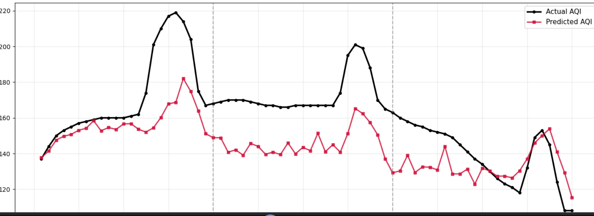

From reading the writeup and the pdf I understand that the following is the pipline of what we are supposed to do.
(Not comprehensive)
Extarct Data from api(s) -> clean, preprocess the data to form features -> train a model to predict future AQI
->built a frontend to display graphs and data and predictions -> cicd every hour to update model.

Note : Most of the code is being generated by an llm for ease. But what code to generate and what models to use is being decided by me.
    I am using llms as a tool for quick code writing while archetecturing th system myself and making decisons on the data I get from the experiments.

First step I will be extracting data and making features from it.
I used the following APIs
1- AQICN : as recommended
2- Open-Meteo : As i have found that open weather only has data from last 5 days only. To get more you have to have a paid tier.

Now i will only be using open-meteo as i seem to blocked by AQICN or rate limited which would not work with the cicd
 part so im solely relying on open meteo

I got data from the aqi endpoint for pollutant in air and weather data as that also dictates how the aqi changes.

Next i merged data from both based on timestamp and engineered features from them.
First i dervied day, hour month details from timestamp, then created historical data for each record (aqi from hour/day ago), 
calculated average and rolling average and dropped rows with Nan values for clean dataset.

Now onto hopscotch setup. I have generated a key from hopscotch but due to some reasons I encounter errors locally with hopscotch installation.
Hence I now run my notebooks on colab.

I trained 6 models
random forest : given in writeup to used
Ridge regression : given in writeup
MLP : writeup mentioned neural networkhence used simplest open
xgboost : its the best for tabular data which is this changes
lstm : effective for sequential data
gru : lighter version of lstm
lightgbm : only used for 1 experiment as its similar to xgboost

Below are the rsme, mae and r2 scores of 5 abalations I ran.

I began with 90 days data on a 80:20 split. Then I increased data to 365 days for full year.
Then i sought to see performance if we only used last three days as dataset.
Then i expanded to 700 days.
Days were increased as deep neural models like lstm and gru work best with more data and 90 days data was not enough.
Details of combinations is given above the scores. Evaluated accross all models.

MODEL PERFORMANCE LEADERBOARD (Sorted by lowest RMSE) trained on 90 days data with 80:20 spliy
RMSE	R²	MAE
XGBoost	13.79	0.8532	7.24
Random Forest	14.62	0.8352	8.55
MLP (Deep Learning)	16.96	0.7782	12.91
GRU	20.68	0.6715	14.34
Ridge Regression	21.61	0.6397	18.06
LSTM	38.46	-0.1357	29.66

MODEL PERFORMANCE LEADERBOARD (Sorted by lowest RMSE) trained on 365 days with 80:20 spliy
RMSE	R²	MAE
XGBoost	19.48	0.7754	8.78
Random Forest	20.83	0.7431	9.94
GRU	21.86	0.7163	12.85
Ridge Regression	24.25	0.6518	16.13
MLP (Deep Learning)	28.13	0.5315	19.45
LSTM	30.44	0.4500	22.71

MODEL PERFORMANCE LEADERBOARD (Sorted by lowest RMSE) trained on 365 days, last three days only used as test set
RMSE	R²	MAE
LSTM	8.86	0.7240	7.92
Random Forest	11.21	0.5588	9.68
XGBoost	14.45	0.2668	10.88
MLP (Deep Learning)	22.01	-0.7021	16.73
Ridge Regression	30.31	-2.2264	26.32
GRU	32.63	-2.7404	29.21

MODEL PERFORMANCE LEADERBOARD (Sorted by lowest RMSE) 700 days and 3 days test set
RMSE	R²	MAE
Random Forest	10.53	0.6102	9.24
XGBoost	11.96	0.4974	10.02
MLP (Deep Learning)	19.26	-0.3036	15.62
LSTM	21.45	-0.6170	19.97
GRU	25.97	-1.3693	22.36
Ridge Regression	27.17	-1.5935	22.81

MODEL PERFORMANCE LEADERBOARD (Sorted by lowest RMSE) 700 days with 80:20 split
RMSE	R²	MAE
LSTM	7.81	0.9636	5.24
LightGBM	15.19	0.8621	7.98
XGBoost	16.04	0.8463	8.10
Random Forest	16.28	0.8416	8.59
GRU	20.55	0.7476	16.25
MLP (Deep Learning)	21.49	0.7241	15.74
Ridge Regression	22.84	0.6882	18.03

Now I am gonna wait 7 days for more data to come at the api and will saved models then again.
Obviously the winner over 700 days is lstm and xgboost has been doing in all categories hence its also shortlisted.

Now I will focus on making the frontend and cicd stuff.

When i was desigening the frontend, I realized that the above trained models may be provy to data leakage as
aqi has a certain formula and I was providing all values to the the models and hence in test set the models 
may be learning the formula.

Hence I will run new experiments with only xgboost, random forest as these were the consistent best performers accross all experiments.
I will also be using lstm as in earlier experiments it simply did not have enough data.

In performing these experiments, i learned that engineering features of how they change instead of just giving features
has given model more to learn and both xgboost and lstm have achieved an high r2 (>90%). These experiments are done in fetch2.ipynb

But ive realized that what predicting next 72 hours actually means. I've been working under the wrong assumption
that I would have pollutants and weather data which I obviously would not have at prediction time. If I did I 
can just calculate the aqi from tat no need to predict.

Hence, I redisened my training strategy. I would keep the last (latest) 72 hours seperate and split the rest data into 80:20 split for training and validation.
These 72 hour readings will be used as a real life simulation and I will see how good the model predicts these 72 hours.

Now the strategy is this for lstm. Train then generate a prediction. Give that prediction back to lstm and generate next prediction. Keep on doing this until we have 72 predictions.
This seems like the intuitive way and it works but it is under predicting values and have a very large rsme. This is due to it using its own prediction which cases it to drift at end.
It also drifted where there was a spike in aqi in real data. Model was too conservative.

Now for xgboost model, i adpoted two strategies. Predicting all 72 hours at once or creating 72 models which predict next 72 hours on their own.
This produed an prediction very similar to the actual one, but it was under predicted.

Researching a bit on how much can I allow my prediction to be off and it is around 10. So I will be aiming for an mae and rsme under 10.
Aqi is divided into categories that means an aqi of 149 and 151 on boundary of 150 would be treated differently.
But an aqi of 149 and 151 is not much different and hence for practical use if error is < 10 (159/139 while it was actually 149) would be acceptable for practical use.

I am having more favourable outcomes with xsgboost 72 models version and hence all future experiments will be done on it.

The graph I have seems to have a sharp spike which is causing the xgboost model to predict wrongly. 
 

I will be trying a little furthur back in data to see if the spike is the reason for high error. otherwise the model is closly following the real graph, its just shifted. After trying weighting the aqi as it performs relatively well for a few hours then some other tricks with hyperparameters. The model is not improving much. But ive noticed that the initail predictions are good while later ones deviate as is expected. As I will be giving the model the correct values when they become available, i repredict the 72 precictions as we get new values and the graph improves but it still has a high mae.